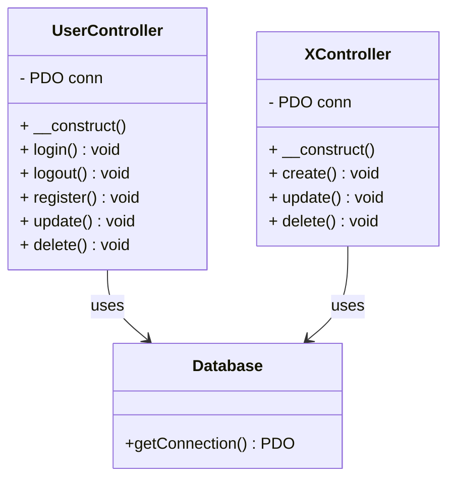

```mermaid
sequenceDiagram
    autonumber

    actor A as Admin
    participant F as Form (HTML)
    participant XC as XController
    participant DB as Database (MySQL)

    %% ---------- CREATE ----------
    A->>F: Submit Create Event<br>(name, location, type)
    F->>XC: POST /createEvent
    XC->>DB: SELECT COUNT(*) FROM EVENTO WHERE Nombre=name
    DB-->>XC: count
    alt Event does NOT exist
        XC->>DB: INSERT INTO EVENTO (Nombre, Localizacion, Tipo)
        DB-->>XC: OK
        XC->>A: Redirect with success message
    else Event exists
        XC->>A: Error: "Event already exists"
    end

    %% ---------- READ (LIST EVENTS) ----------
    A->>XC: Request event list
    XC->>DB: SELECT * FROM EVENTO
    DB-->>XC: List of events
    XC-->>A: Render admin list view

    %% ---------- UPDATE ----------
    A->>F: Submit Update Event<br>(oldName, newName, newLocation, newType)
    F->>XC: POST /updateEvent
    XC->>DB: SELECT COUNT(*) FROM EVENTO WHERE Nombre=newName
    DB-->>XC: count
    alt New name available
        XC->>DB: UPDATE EVENTO SET Nombre=?, Localizacion=?, Tipo=? WHERE Nombre=oldName
        DB-->>XC: OK
        XC->>A: Redirect with success message
    else Name already used
        XC->>A: Error: "New event name already exists"
    end

    %% ---------- DELETE ----------
    A->>F: Submit Delete Event (name)
    F->>XC: POST /deleteEvent
    XC->>DB: DELETE FROM EVENTO WHERE Nombre=name
    DB-->>XC: OK
    XC->>A: Redirect with success message

    XC->>A: Redirect with success message

